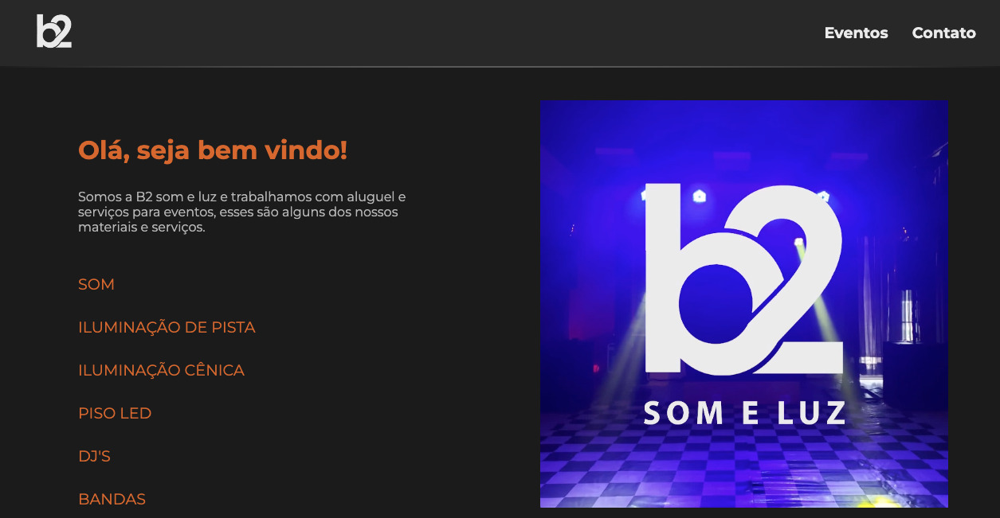

# 💻 #Codando

[🚀 Acesse aqui](https://queiiroz.github.io/b2someluz/)

## 💻 Website

Site desenvolvido do zero para praticar

## 🛠 Tecnologias

- HTML
- CSS
- Git
- JavaScript
- GitHub

<table>
  <tr>
    <td>
     
    </td>
    <td>
      Feito por Gleidson Queiroz.</a> 🙋🏼‍♂️
    </td>
  </tr>
</table>
